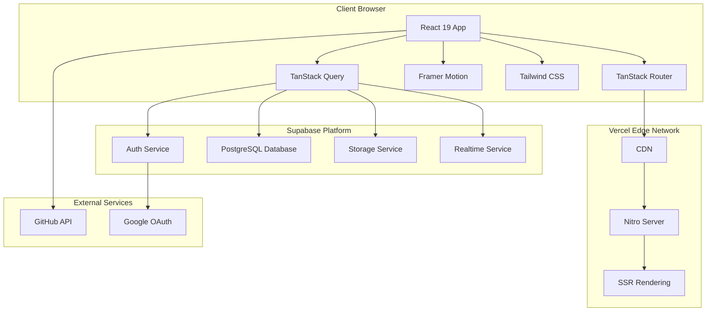
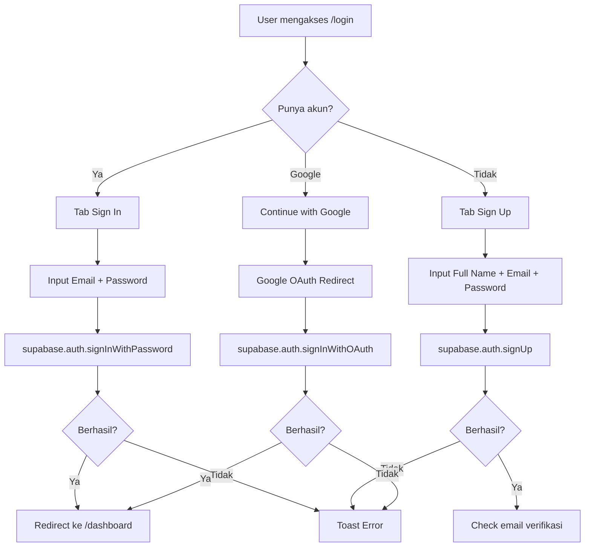
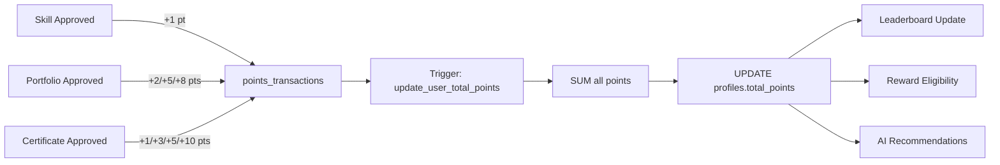
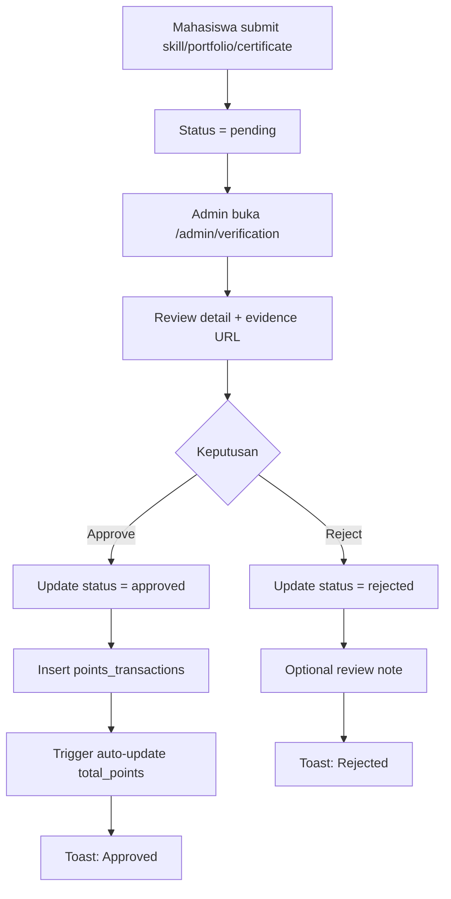
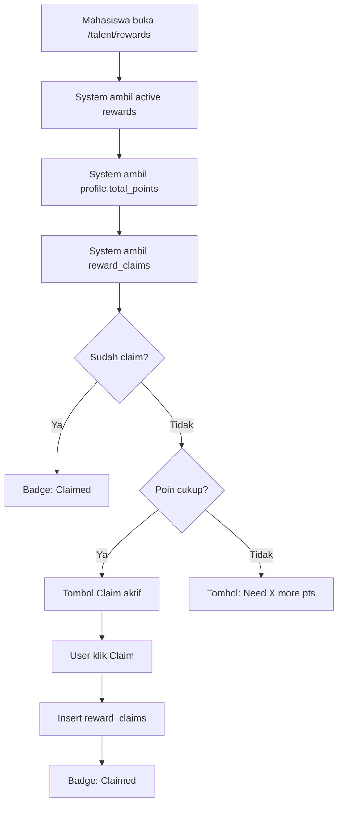
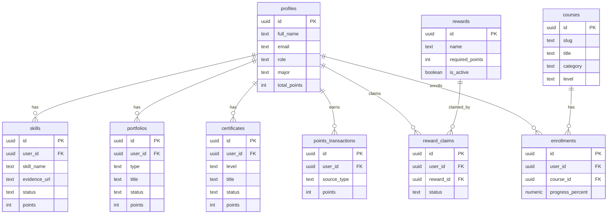

# NebulaLearn

> **Live Site:** https://nebulalearn-umber.vercel.app/

An all-in-one learning platform with courses, competitions, live webinars, cloud drive, project showcase, and a talent hub with skill verification, leaderboard, rewards, and AI recommendations.

---

## Features

- **Structured Learning Paths** — Curated courses from beginner to pro across AI, cybersecurity, data, cloud, and web dev
- **Hackathons & Competitions** — Compete with prizes and leaderboards
- **Live Webinars** — Weekly sessions with industry mentors, Q&A, and replays
- **Cloud Drive** — Store your project files securely with real-time sync
- **Project Showcase** — Display your GitHub projects publicly
- **Skill Wallet** — Track your progress and achievements with verification
- **Talent Hub** — Submit skills, portfolios, and certificates for admin verification
- **Leaderboard** — Rank students by verified points
- **Rewards System** — Redeem points for rewards
- **AI Recommendations** — Personalized suggestions to grow your talent
- **Admin Dashboard** — Manage verifications, rewards, students, and opportunities

---

## Tech Stack

| Layer | Technology |
|---|---|
| Framework | React 19 + TanStack Router + TanStack Start |
| Styling | Tailwind CSS 4 + Framer Motion |
| UI Components | Radix UI + shadcn/ui |
| Backend | Supabase (PostgreSQL, Auth, Storage, Realtime) |
| Deployment | Vercel (production) + Docker (local/self-hosted) |

---

## System Architecture



---

## Authentication Flow



---

## Points & Verification Flow



---

## Admin Verification Flow



---

## Reward Claim Flow



---

## Database Schema



---

## Points Reference

| Type | Sub-type | Points |
|---|---|---|
| Skill | Any | +1 |
| Portfolio | Personal | +2 |
| Portfolio | Freelance | +5 |
| Portfolio | Industri | +8 |
| Certificate | Local | +1 |
| Certificate | Regional | +3 |
| Certificate | Nasional | +5 |
| Certificate | Internasional | +10 |

---

## Getting Started

### Prerequisites

- Node.js 18+ or [Bun](https://bun.sh)
- A [Supabase](https://supabase.com) project

### Installation

```bash
git clone https://github.com/adityaagustiawan/nebula-learn.git
cd nebula-learn
bun install
```

### Environment Variables

Copy `.env.example` to `.env` and fill in your Supabase credentials:

```bash
cp .env.example .env
```

### Development

```bash
bun run dev
```

Visit [https://nebulalearn-umber.vercel.app/](https://nebulalearn-umber.vercel.app/) for the live site.

### Build

```bash
bun run build
```

### Docker

```bash
cp .env.example .env
docker compose up --build
# Open http://localhost:3000
```

---

## Project Structure

```
├── Dockerfile               # Docker build (Node 20 Alpine + Bun)
├── docker-compose.yml       # Docker Compose config
├── src/
│   ├── components/          # UI and feature components
│   │   ├── learning/        # LiveFeed, platform-bootstrap
│   │   └── ui/              # shadcn/ui components
│   ├── contexts/            # React contexts (theme, realtime)
│   ├── hooks/               # Custom hooks (auth, learning, live-catalog)
│   ├── integrations/        # Supabase client
│   ├── lib/                 # Utilities and types
│   ├── routes/              # Page routes (TanStack Router file-based)
│   │   ├── admin/           # Admin dashboard, students, verification, rewards
│   │   └── talent/          # Student hub: skills, portfolios, leaderboard, rewards, AI recs
│   └── styles.css           # Global styles and theme
└── supabase/
    └── migrations/          # Database schema (SQL)
```

---

## All Pages/Routes

| Route | Description | Role |
|---|---|---|
| `/` | Homepage / Landing Page | Public |
| `/login` | Login & Sign Up | Public |
| `/dashboard` | User Dashboard | User |
| `/courses` | Course Listing | User |
| `/courses/:slug` | Course Detail | User |
| `/competitions` | Competitions / Hackathons | User |
| `/webinars` | Live Webinars | User |
| `/projects` | Project Showcase | User |
| `/drive` | Cloud Drive | User |
| `/talent` | Talent Hub | User |
| `/talent/profile` | Edit Profile | User |
| `/talent/skills` | Skill Management | User |
| `/talent/portfolios` | Portfolio Management | User |
| `/talent/certificates` | Certificate Management | User |
| `/talent/leaderboard` | Leaderboard | User |
| `/talent/rewards` | Reward Catalog & Claim | User |
| `/talent/recommendations` | AI Recommendations | User |
| `/talent/opportunities` | Opportunities | User |
| `/admin` | Admin Dashboard | Admin |
| `/admin/students` | Student Management | Admin |
| `/admin/verification` | Verification Queue | Admin |
| `/admin/rewards` | Reward Management | Admin |
| `/admin/opportunities` | Opportunity Management | Admin |

---

## Roles

| Role | Access |
|---|---|
| **Admin** | Dashboard, student management, verification queue, reward management, opportunity management |
| **Mahasiswa** | Dashboard, talent hub (skills, portfolios, certificates), leaderboard, rewards, AI recommendations, cloud drive |

---

## Deployment

### Vercel (Production)

Live at: https://nebulalearn-umber.vercel.app/

### Docker (Local)

```bash
docker compose up --build
```

---

## Credits

- **Nama**: Adytia Agustiawan
- **NIM**: 25.60.0209
- **Program Studi**: Bachelor of Information Technology
- **Universitas**: Universitas Amikom Yogyakarta

## License

MIT
